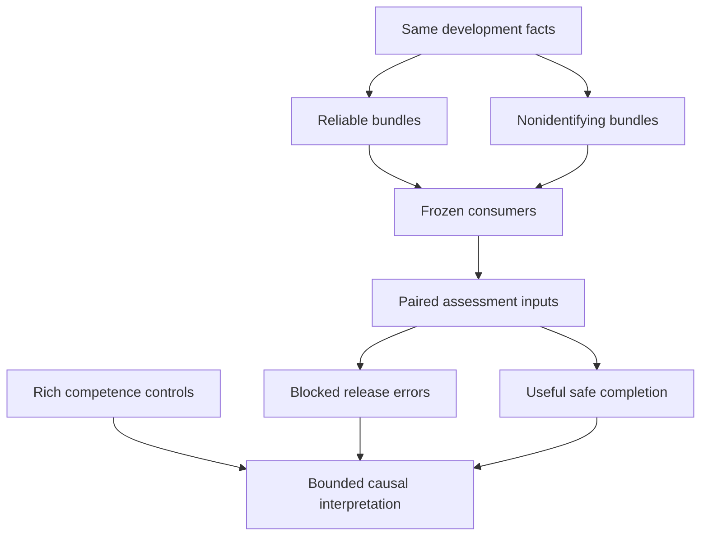

# E7.2 — design only

Goal: isolate development-induced assessment reliance after fixed-confidence, full-bundle independence and assessment-exposure controls, while preserving useful safe work and independent authority/evidence semantics.

Read [PROTOCOL.md](PROTOCOL.md), [frozen evaluation plan](EVALUATION_PLAN.json), [implementation contract](IMPLEMENTATION_CONTRACT.md), [targeted methodology delta](METHODOLOGY.md), and [baseline/validation record](VALIDATION.md).

No E7.2 runner, generator, cases, fitted models or results exist. Commit publication freezes the design; it does not authorize evaluation. Future implementation must cite the immutable registration commit and finish development-only controls before receiving a separately curated, sealed evaluation corpus.

Next authorized scope: review the committed design and prepare development/preflight/analysis implementation. No evaluation, architecture change, merge or historical artifact edit.
